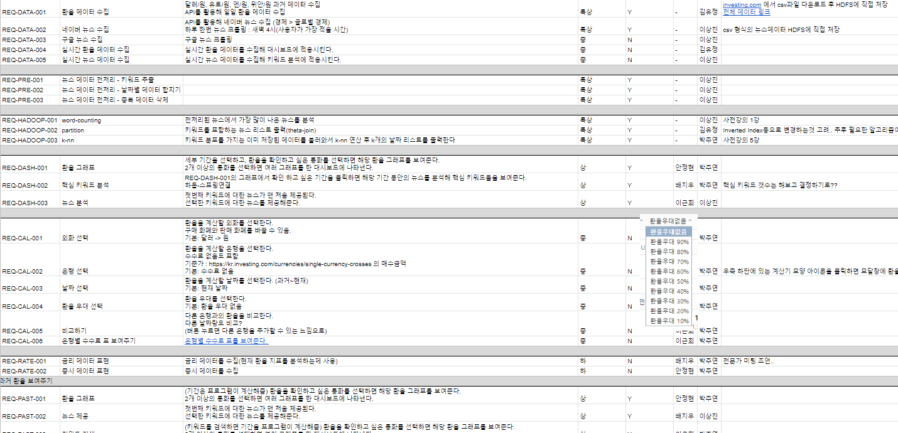
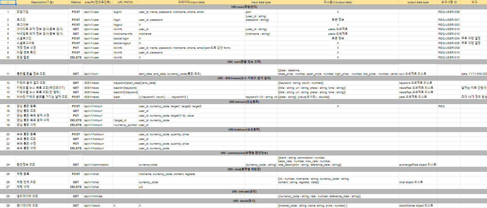
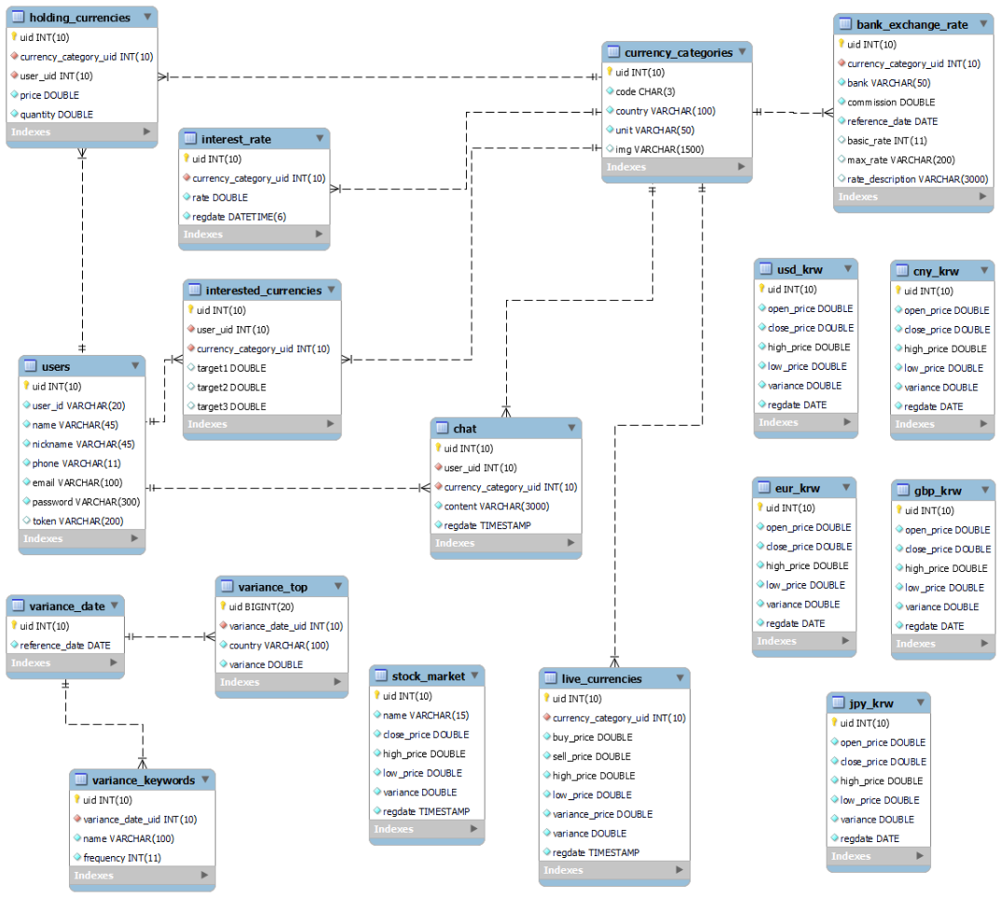
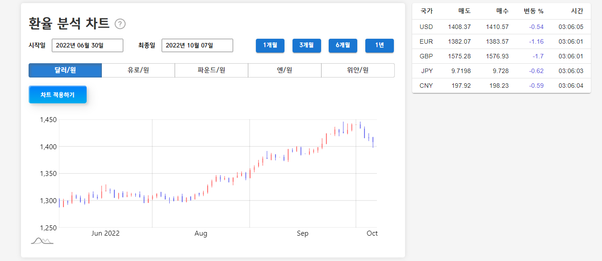
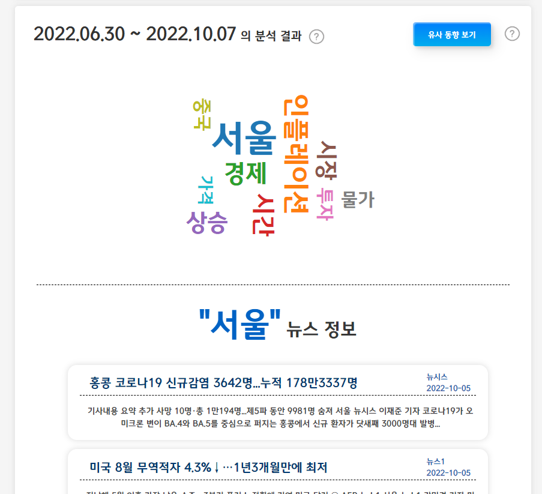
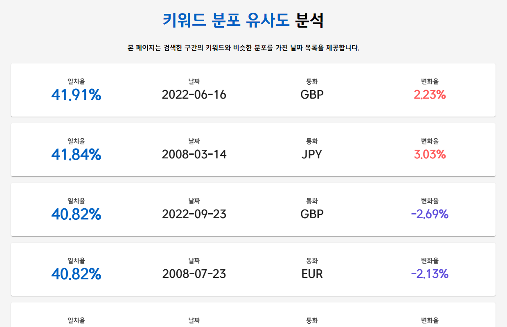
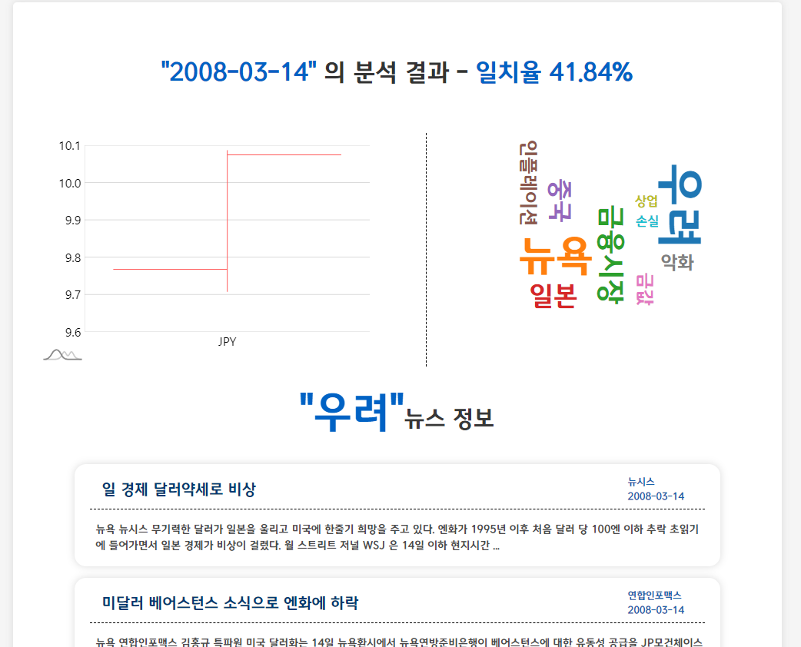
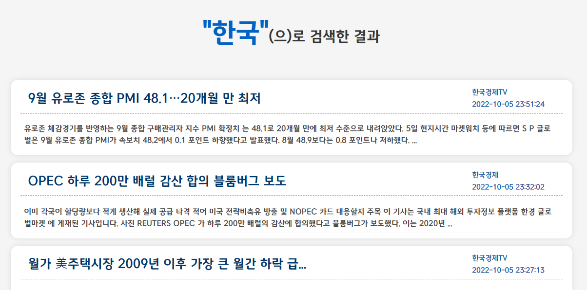
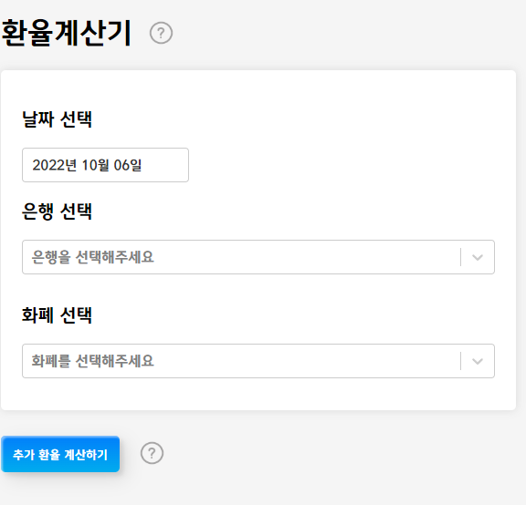
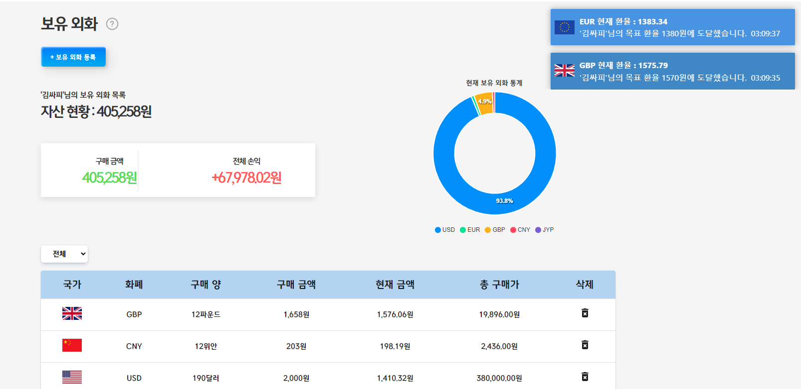

# S$EN(S$afy Exchange News)

## 링크 : [S$EN 홈페이지](https://j7e204.p.ssafy.io/)

## 소개 영상 : [소개 영상 링크]()

## 📘 프로젝트 진행 기간

2022.08.22(월) ~ 2022.10.07(금)  
SSAFY 7기 2학기 특화 프로젝트 빅데이터 분산 도메인 - S$EN

## :grey_question: S$EN - 배경

최근 커지고 있는 환율 변동 추이,  
무슨 이유로 환율의 변동이 일어났는지 궁금하진 않으셨나요?  
검색을 해봐도 중복된 내용때문에 '그래서 뭐 때문인데?' 라는 생각이 들진 않으셨나요?  

해외 여행에 관심이 많은 일반인부터
인사이트가 필요한 전문가까지! 

**S$EN에서 환율의 변동의 이유를 한눈에 알아보세요!**

## 🔎 S$EN - 개요

_- 전국 최초 뉴스 데이터 분석 플랫폼 -_

* 기간별 환율 관련 정보 제공
  
  * 과거 환율 변동 데이터를 수집한 후, 사용자가 설정한 구간의 환율 변동폭을 실시간으로 분석하여 제공합니다.
  
  * 네이버 뉴스 API로 뉴스 데이터를 크롤링하고, keyBert를 활용하여 자연어 전처리를 수행합니다.
  
  * 전처리된 뉴스 데이터에 대해 Hadoop의 맵리듀스를 활용한 WordCount를 실행해서 주요 키워드를 추출합니다.
  
  * 주요 키워드의 분포를 워드클라우드로 보여주고, 키워드별로 뉴스를 분류하여 보여줍니다.

* 과거 동향 분석
  
  * Top-K Closest Point Search 알고리즘을 활용하여, 주요 키워드의 분포와 비슷한 과거 날짜들을 제공하고 선택하여 세부 정보를 볼 수 있습니다.
  * 선택한 과거 날짜의 주요 환율 변동, 키워드, 뉴스를 보여줍니다.

* 추가기능
  
  * 웹소켓을 활용하여 실시간 환율 정보를 제공합니다.
  
  * 사용자가 보유한 외화를 등록하여 관리할 수 있고, 목표한 환율에 도달하였을 때 알림기능을 제공합니다.
  
  * 환율계산기를 활용하여 주요 은행별 환전정보를 제공하고, 실제 환율로 환전을 계산해 볼 수 있습니다.

## :newspaper: 사이트 사용 방법

- #### 메인화면

---

## ✔ 주요 기술

---

**Backend**

- Springboot
- Spring Data JPA
- Spring Security
- Spring Web
- Query DSL
- Swagger
- Gradle
- MySQL

**Frontend**

- React
- HTML
- JavaScript
- CSS

**CI/CD**

- AWS EC2
- NGINX
- SSL
- Docker
- Jenkins

---

## ✔ 프로젝트 파일 구조

---

### Frontend

```
src
    ├─api   
    ├─assets
    │  └─images    
    ├─components
    │  ├─Calendar
    │  ├─Chart   
    │  ├─Community
    │  │  ├─CommunityButton   
    │  │  ├─CommunityForm     
    │  │  └─CommunityList        
    │  ├─ExchangeCalc     
    │  ├─Keyword     
    │  ├─LiveCurrencyTable     
    │  ├─Loading
    │  │  ├─KeywordLoding     
    │  │  └─PostLoading         
    │  ├─MyAsset 
    │  │  ├─MyAssetChart    
    │  │  ├─MyAssetFilter    
    │  │  ├─MyAssetItemList    
    │  │  ├─MyAssetModal   
    │  │  └─MyAssetTotal        
    │  ├─MyInterest
    │  │  ├─MyInterestEdit    
    │  │  ├─MyInterestItemList     
    │  │  └─MyInterestModal        
    │  ├─MySet      
    │  ├─NavBar   
    │  ├─News    
    │  ├─Past     
    │  └─Search 
    │      └─SearchPagination            
    ├─context    
    ├─pages
    │  ├─CalculatorPage   
    │  ├─CommunityPage      
    │  ├─LoginPage    
    │  ├─MainPage    
    │  ├─ProfilePage     
    │  ├─ProfileUpdatePage      
    │  ├─SearchPage     
    │  └─SignupPage       
    ├─_actions    
    └─_reducers
```

### Backend

```
main
    ├─generated
    │  └─com
    │      └─ssafy
    │          └─db
    │              └─entity                   
    ├─java
    │  └─com
    │      └─ssafy
    │          ├─api
    │          │  ├─controller
    │          │  ├─request
    │          │  ├─response
    │          │  └─service       
    │          ├─common
    │          │  ├─auth
    │          │  ├─exception
    │          │  │  └─handler
    │          │  ├─model
    │          │  │  └─response
    │          │  └─util
    │          ├─config
    │          └─db
    │              ├─entity
    │              └─repository
    └─resources
        └─ssl
```

### Backend News

```
main
    ├─generated
    │  └─com
    │      └─ssafy
    │          └─db
    │              └─entity   
    ├─java
    │  └─com
    │      └─ssafy
    │          ├─api
    │          │  ├─controller    
    │          │  ├─request
    │          │  ├─response     
    │          │  └─service         
    │          ├─common
    │          │  ├─auth
    │          │  ├─exception
    │          │  │  └─handler 
    │          │  ├─model
    │          │  │  └─response        
    │          │  └─util
    │          │      └─jsch        
    │          ├─config    
    │          └─db
    │              ├─entity   
    │              └─repository                   
    └─resources
```

## ✔ 협업 툴

---

- [Gitlab](https://lab.ssafy.com/s07-bigdata-dist-sub2/S07P22E204)
- [Notion](https://www.notion.so/ea204fc348b74e44a2b471b056a0fa2e)
- [JIRA](https://jira.ssafy.com/projects/S07P22E204/summary)
- [Figma](https://www.figma.com/file/pF65WcrWIeXDs9YhwG9yYJ/S%24EN?node-id=0%3A1)
- [ERD Cloud](https://www.erdcloud.com/d/dQeLSFFd9ZPwbw6eE)
- [MatterMost](https://meeting.ssafy.com/s07p11e1/channels/333)
- [Webex](https://ssafyclass.webex.com/meet/jeong746746)

## ✔ 협업 환경

---

- 요구사항 명세서/API 명세서
  - [구글 드라이브](https://docs.google.com/spreadsheets/d/1tmBt6pM6bLSg9MpKH8hYOaNGYzPAehpVVSvjy-d85OU/edit?hl=ko#gid=538209592)에서 기획 내용을 공유 및 수정
- Gitlab
  - 코드 버전 관리
  - MR 템플릿 사용
  - 기능별 branch 생성, 개발
  - 커밋 컨밴션 Udacity convention 사용
- JIRA
  - 개발 기획에 따라 에픽, 이슈 생성
  - 매주 첫 워킹데이에 개인 목표량을 설정하여 Sprint 진행
  - 업무의 우선순위를 설정하고, 할당량을 정하여 Story Point를 설정한 뒤 In-Progress -> Done 순으로 작업
  - 소멸 차트를 통해 스프린트 진척도 확인
- 회의
  - 매일 아침 스크럼 진행, 진행 중인 내용 및 이슈 공유
  - 프론트엔드 <-> 백엔드 요구사항 소통
  - 매일 오후 스크럼 진행, 오늘 진행한 내용 공유
- Notion
  - 회의록/피드백/스크럼/상담내용 등 저장
  - 개발 참고 자료 업로드, 필요 개념 공유
  - 개발 도중 발생한 이슈 저장
  - 컨벤션 정리
  - 각종 명세서 등 모두가 공유해야 하는 문서 관리
- Figma
  - 목업 제작, 와이어프레임제작, 디자인 작업 공유  
- ERD Cloud
  - Database 설계 공유

## ✔ 창사부이 팀원 역할 분배

---

| Name     | 김유정                                                                                                                                             | 박주연                                                                         | 배지우                                       | 안정현                                       | 이근희                                         | 이상진                                       |
|:--------:| ----------------------------------------------------------------------------------------------------------------------------------------------- | --------------------------------------------------------------------------- | ----------------------------------------- | ----------------------------------------- | ------------------------------------------- | ----------------------------------------- |
| Profile  |  |  |  |  |    |  |
| Position | 팀장 & Backend & WebSocket & UCC                                                                                                                  | Backend & Hadoop & UI/UX                                                    | Frontend & UI/UX & WebSocket              | Frontend & UI/UX & UCC                    | Frontend & UI/UX & CI/CD                    | Backend & Hadoop & CI/CD                  |
| Git      | [yujeonge](https://github.com/yujeonge)                                                                                                         | [juyeoon](https://github.com/juyeoon)                                       | [JIWOO2](https://github.com/JIWOO2)       | [hyunii02](https://github.com/hyunii02)   | [leeghee282](https://github.com/leeghee282) | [leesj8676](https://github.com/leesj8676) |

## ✔ 설계 산출물

---

- [설계 문서](https://docs.google.com/spreadsheets/d/1tmBt6pM6bLSg9MpKH8hYOaNGYzPAehpVVSvjy-d85OU/edit?hl=ko#gid=538209592)
  
  - 요구사항 명세서
  
  
  
  - API 명세서
  
  
  
  - ERD



## ✔ 프로젝트 결과물

---

#### 메인화면






#### 과거 동향 분석





#### 뉴스 검색



#### 환율계산기



#### 보유 외화 현황 및 알림



## [포팅메뉴얼](https://docs.google.com/document/d/1PUsWgoy-QwBiDsYJPjsXUjD8dNHbjoMDskJ8AVL7sXk/edit)

---

## 👔 발표 자료

---

- [중간발표자료]()
- [최종발표자료]()

---
